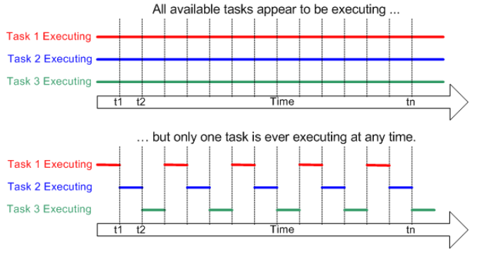

# FreeRTOS Pico Program 01: Tasks

## Table of Content
[Overivew](#overview)<br>
[Objective](#objective)<br>
[Sources](#sources)<br>
[Building](#building)<br>
[Executing](#executing)<br>
[Useful](#useful)<br>
[Learnings](#learnings)<br>

## Overview
The Raspberry RP2350 uses a pre-emptive, fixed priority scheduling policy with round robin, time slicing of equal priority tasks. 

In simpler terms:
- priority for tasks will not change during execution
- task that has higher priority takes precedence on core
- tasks with same priority will take turns running (time-slicing/round-robin)
- scheduler will switch between different tasks of equal priority during tick interrupt (time-slicing/round-robin)

So the FreeRTOS will make it seem as if multiple tasks are running concurrently!


To switch between tasks of the same priority (round robin) there is a tick interrupt that causes the scheduler to review which task needs to run next and context switch to it.


Tasks have a state tied with them:
- Running: task is currently executing on the core
- Ready: task is not running on core but is ready for execution
- Blocked: task is waiting for a temporal or external event
- Suspended: task not running but can be restarted with API calls

 
## Objective
[] Create an application that will spin up a couple of tasks to showcase priority and scheduling concepts.

## Sources
So I continued reading Chapter 4 in the FreeRTOS Kernel documentation and started practicing a bit more with tasks.

Simple_Tasks:
[] Pretty simple source file where I wanted to play around with creating tasks of different priorities to see how the scheduler allocates execution time. 

Starve_Tasks:
[] Wanted to see what happens when a higher priority thread takes up most of the execution time.

Blink_Tasks:
[] Not really that different from the Simple_Tasks source but wanted to blink some LEDs as tasks. Just playing around with tasks of the same priority having different delay times.

## Setup
Modify the FreeRTOSConfig.h:
- Update the configMAX_PRIORITES
- Enable Time Slicing
    - update configUSE_TIME_SLICING = 1
- Modify the rate at which Tick Interrupts occur
    - update 

## Building

Navigate to build dir and execute cmake & make
```
	mkdir build
	cd build
	cmake .. && make
	
	# For generating build logs for debugging...
	# cmake --trace-expand .. 2>&1 | tee cmake_build_output.txt && make 2>&1 | tee make_build_output.txt
```

Flash the built .uf2 file onto the Raspberry Pi Pico
```
	# connect the pico2 via USB
	# Drag & drop the .uf2 file into the location of where the Pico2 was connected
```

## Useful
- View logs from the Kernel to see USB connections
```
	$ watch -n 1 "sudo dmesg" | tail -n 20"
```
- Open Minicom to see serial 
```
	$ watch -n 1 "sudo dmesg" | tail -n 20"
```

## Learnings
```
Q) What is a scheduler?
A) This is a Software routine that will determine which RTOS task executes on the processor core

Q) What is priority?
A) A method to give order to the tasks that will be executed by the scheduler.
AA) If priority was: 0 highest, 3 lowest, if the scheduler was currently executing task 1 (priority 2) and task 2 (priority 1) needed to run, then the cpu will yield for task 2.

Q) What is context switching?
A) When the current state of the CPU and Memory needs to be saved for the current task so that the next task can have a "clean slate" to work with.  
```
