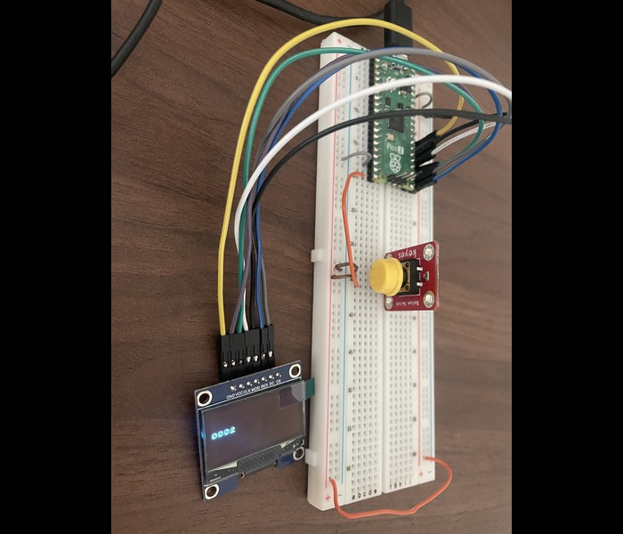

# FreeRTOS Pico Program 04: ISRs & Timers

## Table of Content
[Overivew](#overview)<br>
[Objective](#objective)<br>
[Building](#building)<br>
[Executing](#executing)<br>
[Useful](#useful)<br>
[Learnings](#learnings)<br>

## Overview
ISRs are used to handle Interrupts that occur on the CPU. Using the pico-sdk, I will showcase how to interrupt on different events to complete tasks.<br>

Timers are used to periodically execute a callback function. I used it to implement a button de-bouncer logic.<br>
 
## Objective
- [] Button pressed triggers ISR which updates the SH1106 
- [] Button press triggers ISR which creates semaphore that task to update SH1106 is waiting on
- [] Two tasks can access SH1106 to update but one increments because of button press

## Setup
Modify the FreeRTOSConfig.h:
- Update the configMAX_PRIORITES
- Enable Time Slicing
    - update configUSE_TIME_SLICING = 1
- Enable indefinite waits
    - INCLUDE_vTaskSuspend = 1
- Enable Timers
    - configUSE_TIMERS = 1
- Change Timer priority
    - configTIMER_TASK_PRIORITY
    


## Building

Navigate to build dir and execute cmake & make
```
	mkdir build
	cd build
	cmake .. && make
	
	# For generating build logs for debugging...
	# cmake --trace-expand .. 2>&1 | tee cmake_build_output.txt && make 2>&1 | tee make_build_output.txt
```

Flash the built .uf2 file onto the Raspberry Pi Pico
```
	# connect the pico2 via USB
	# Drag & drop the .uf2 file into the location of where the Pico2 was connected
	OR
	$ cp <filename>.uf2 <dir_location>/RP2350
```

## Useful
- View logs from the Kernel to see USB connections
```
	$ watch -n 1 "sudo dmesg" | tail -n 20"
```
- Open Minicom to see serial 
```
	$ watch -n 1 "sudo dmesg" | tail -n 20"
```

## Learnings
```
- [] Tying IRQ with ISR callback function (pico-sdk & FreeRTOS)
- [] Executing ISR because of a hardware event
- [] Deferring processing of ISR to a Task
- [] Giving binary semaphore
- [] Utilizing FreeRTOS Timer to create button de-bouncing logic
```
